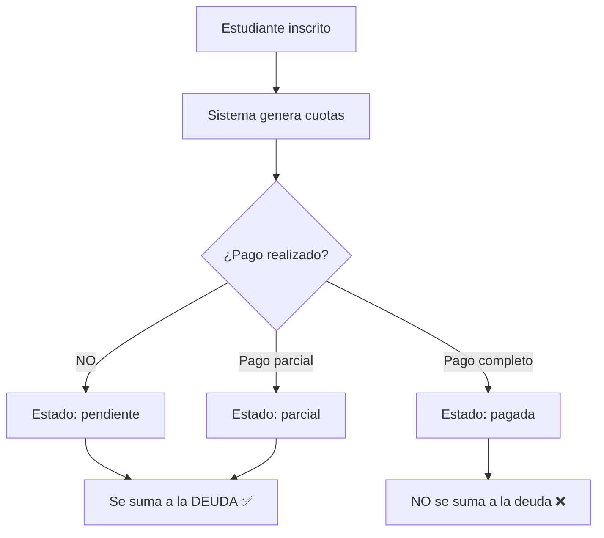

# 💰 CÁLCULO DE DEUDA - Sistema de Cuotas

## 📊 ¿CÓMO SE ESTIMA LA DEUDA?

La deuda se calcula desde la tabla **`cuota_programa_estudiantes`** en la base de datos del CRM (PostgreSQL).

---

## 🎯 FÓRMULA BASE

```sql
DEUDA TOTAL = SUM(monto) 
WHERE estado IN ('pendiente', 'parcial')
  AND estudiante_programa_id = [ID del programa del estudiante]
```

**La deuda es la suma de todas las cuotas que NO han sido pagadas completamente.**

---

## 📝 ESTADOS DE CUOTAS

| Estado | Descripción | ¿Se cuenta como deuda? |
|--------|-------------|------------------------|
| **`pendiente`** | Cuota no pagada | ✅ **SÍ** (100% del monto) |
| **`parcial`** | Pago parcial realizado | ✅ **SÍ** (100% del monto) |
| **`pagada`** | Cuota completamente pagada | ❌ **NO** |

> ⚠️ **IMPORTANTE:** Aunque una cuota esté en estado `parcial`, **SE CUENTA COMO DEUDA COMPLETA**.

---

## 🧮 EJEMPLO PRÁCTICO

### Estudiante: Juan Pérez
**Programa:** Bachelor of Business Administration (BBA)  
**Duración:** 24 meses  
**Cuota mensual:** Q825.00

### Cuotas Generadas:

```
┌─────────────────┬─────────┬────────────┬─────────────────┐
│ Mes             │ Monto   │ Estado     │ Cuenta como     │
│                 │         │            │ deuda?          │
├─────────────────┼─────────┼────────────┼─────────────────┤
│ Enero 2025      │ Q825    │ pagada     │ ❌ NO           │
│ Febrero 2025    │ Q825    │ pagada     │ ❌ NO           │
│ Marzo 2025      │ Q825    │ pendiente  │ ✅ SÍ (Q825)    │
│ Abril 2025      │ Q825    │ pendiente  │ ✅ SÍ (Q825)    │
│ Mayo 2025       │ Q825    │ pendiente  │ ✅ SÍ (Q825)    │
│ Junio 2025      │ Q825    │ parcial    │ ✅ SÍ (Q825)    │
└─────────────────┴─────────┴────────────┴─────────────────┘

TOTAL DEUDA = Q825 + Q825 + Q825 + Q825 = Q3,300
```

---

## 💻 IMPLEMENTACIÓN EN EL CÓDIGO

### Servicio: `UniversoEstudiantesServiceSimple.php`

```php
// 1️⃣ Obtener todas las cuotas del estudiante
$cuotas = CuotaProgramaEstudiante::where('estudiante_programa_id', $programaId)->get();

// 2️⃣ Filtrar cuotas pendientes y parciales
$cuotasPendientes = $cuotas->whereIn('estado', ['pendiente', 'parcial']);

// 3️⃣ Sumar los montos
$totalDeuda = $cuotasPendientes->sum('monto');

// 4️⃣ Contar cuotas
$numeroCuotasPendientes = $cuotasPendientes->count();
```

### Consulta SQL Equivalente:

```sql
SELECT 
    SUM(monto) as total_deuda,
    COUNT(*) as cuotas_pendientes
FROM cuota_programa_estudiantes
WHERE estudiante_programa_id = 123
  AND estado IN ('pendiente', 'parcial')
```

---

## 🔍 CAMPOS RELACIONADOS

### Tabla: `cuota_programa_estudiantes`

| Campo | Tipo | Descripción |
|-------|------|-------------|
| `id` | int | ID único de la cuota |
| `estudiante_programa_id` | int | FK → estudiante_programas.id |
| `monto` | decimal(10,2) | Monto de la cuota (ej: 825.00) |
| `estado` | varchar | 'pendiente', 'parcial', 'pagada' |
| `fecha_vencimiento` | date | Fecha límite de pago |
| `numero_cuota` | int | Número secuencial (1, 2, 3...) |
| `created_at` | timestamp | Fecha de creación |

---

## 📈 FLUJO COMPLETO



---

## 🚨 CASOS ESPECIALES

### 1. Estudiante con pagos adelantados
```
Cuota actual: Marzo 2025 (pendiente)
Último pago: Junio 2025 (adelantado)

→ La cuota de Marzo SIGUE siendo "pendiente" hasta que se marque como "pagada"
→ SE CUENTA como deuda aunque el estudiante haya pagado adelantado
```

### 2. Estudiante con becas o descuentos
```
Cuota original: Q825
Beca del 50%: -Q412.50
Monto a pagar: Q412.50

→ La cuota se genera con monto = Q412.50
→ NO hay descuento a posterior, el monto YA viene ajustado
```

### 3. Cuotas vencidas (MOROSO)
```
Fecha actual: 28/11/2025
Cuota: Marzo 2025 (fecha_vencimiento: 31/03/2025)
Estado: pendiente

→ fecha_vencimiento < HOY → MOROSO ✅
→ La deuda SE SUMA igual
→ Adicionalmente se marca como "moroso" en el estado financiero
```

---

## 🎯 CONCLUSIÓN

**La deuda es simplemente:**

```
DEUDA = Todas las cuotas que NO están pagadas completamente
```

**NO se basa en:**
- ❌ Fechas de vencimiento
- ❌ Cálculos complejos
- ❌ Estimaciones

**Se basa ÚNICAMENTE en:**
- ✅ Estado de la cuota (`pendiente` o `parcial`)
- ✅ Monto definido en la cuota
- ✅ Suma directa

---

## 📞 CONSULTAS ÚTILES

### Ver deuda de un estudiante específico:
```sql
SELECT 
    ep.id,
    p.nombres || ' ' || p.apellidos as estudiante,
    prog.nombre as programa,
    COUNT(CASE WHEN c.estado IN ('pendiente','parcial') THEN 1 END) as cuotas_pendientes,
    SUM(CASE WHEN c.estado IN ('pendiente','parcial') THEN c.monto ELSE 0 END) as deuda_total
FROM estudiante_programas ep
JOIN prospectos p ON ep.prospecto_id = p.id
JOIN programas prog ON ep.programa_id = prog.id
LEFT JOIN cuota_programa_estudiantes c ON c.estudiante_programa_id = ep.id
WHERE p.carnet = 'asm2022990'
GROUP BY ep.id, p.nombres, p.apellidos, prog.nombre
```

### Ver todas las cuotas pendientes:
```sql
SELECT 
    p.carnet,
    p.nombres || ' ' || p.apellidos as estudiante,
    c.numero_cuota,
    c.monto,
    c.estado,
    c.fecha_vencimiento
FROM cuota_programa_estudiantes c
JOIN estudiante_programas ep ON c.estudiante_programa_id = ep.id
JOIN prospectos p ON ep.prospecto_id = p.id
WHERE c.estado IN ('pendiente', 'parcial')
ORDER BY p.carnet, c.numero_cuota
```

---

## 🔗 Referencias

- **Servicio:** `app/Services/UniversoEstudiantesServiceSimple.php`
- **Modelo:** `app/Models/CuotaProgramaEstudiante.php`
- **Documentación relacionada:** `EXPLICACION_CALCULO_MOROSOS.md`
- **Fecha:** 28 de Noviembre 2025
