# 🎯 ESTADOS DE ESTUDIANTES EN MOODLE

## 📊 LÓGICA DE ESTADOS COMBINADOS

En el sistema Moodle, el estado de un estudiante se define por **DOS campos combinados**:

1. **`suspended`** (campo nativo de Moodle - `mdl_user.suspended`)
2. **`status_personalizado`** (campo personalizado - `mdl_user_info_data` con `fieldid=1`)

---

## 🔍 TABLA DE ESTADOS REALES

| Estado Real | Campo Personalizado | Suspended | Significado | Total |
|-------------|---------------------|-----------|-------------|-------|
| ✅ **Activo Normal** | `Activo` | `0` | Estudiante activo cursando normalmente | **687** (23.83%) |
| ⏸️ **Activo Pausado** | `Activo` | `1` | Estudiante que pausó temporalmente su actividad | **4** (0.14%) |
| 🎓 **Graduado** | `Graduado` | `1` | Estudiante que completó y se graduó del programa | **539** (18.70%) |
| 🚫 **Suspendido** | `Suspendido` | `1` | Estudiante suspendido totalmente | **1** (0.03%) |
| ❌ **Inactivo/Expulsado** | `Inactivo` | `1` | Estudiante expulsado o inactivo permanente | **5** (0.17%) |

**Total de estudiantes:** 2,883 (100%)

---

## 🧩 LÓGICA DETALLADA

### ✅ Activo Normal
- **Descripción:** Estudiante que está cursando actualmente
- **Plataforma:** NO suspendido (`suspended=0`)
- **Estado:** Activo (`status=Activo`)
- **Acciones posibles:** Puede acceder a la plataforma, matricular cursos, participar en actividades

### ⏸️ Activo Pausado
- **Descripción:** Estudiante que pausó temporalmente (ej: permiso médico, viaje, etc.)
- **Plataforma:** Suspendido temporalmente (`suspended=1`)
- **Estado:** Sigue siendo Activo (`status=Activo`)
- **Diferencia con Activo Normal:** No puede acceder a la plataforma hasta que se reactive
- **Nota:** Es una suspensión **temporal y reversible**

### 🎓 Graduado
- **Descripción:** Estudiante que finalizó exitosamente el programa
- **Plataforma:** Suspendido (`suspended=1`) porque ya no está cursando
- **Estado:** Graduado (`status=Graduado`)
- **Nota:** La cuenta se mantiene suspendida para evitar confusión con estudiantes activos

### 🚫 Suspendido
- **Descripción:** Estudiante con suspensión disciplinaria o administrativa
- **Plataforma:** Suspendido (`suspended=1`)
- **Estado:** Suspendido (`status=Suspendido`)
- **Diferencia con pausado:** Es una medida **disciplinaria o administrativa**

### ❌ Inactivo/Expulsado
- **Descripción:** Estudiante expulsado permanentemente o dado de baja definitiva
- **Plataforma:** Suspendido (`suspended=1`)
- **Estado:** Inactivo (`status=Inactivo`)
- **Nota:** Es **permanente e irreversible** (a diferencia del pausado)

---

## 💻 IMPLEMENTACIÓN EN CÓDIGO

### Backend (Laravel)

```php
// UniversoEstudiantesServiceSimple.php

// Consulta con JOIN a campos personalizados
$sql = "
    SELECT
        u.id,
        u.username as carnet,
        u.suspended,
        status_field.data as status_personalizado
    FROM mdl_user u
    LEFT JOIN mdl_user_info_data status_field 
        ON status_field.userid = u.id 
        AND status_field.fieldid = 1
    WHERE u.username LIKE 'asm%'
";

// Filtros
if (isset($filtros['suspended'])) {
    $sql .= " AND u.suspended = ?";
}

if (!empty($filtros['status_personalizado'])) {
    $sql .= " AND status_field.data = ?";
}
```

### Frontend (React/TypeScript)

```tsx
// Mapear estado del frontend a backend
const mapearEstadoReal = (estadoReal: string) => {
  const params: any = {}
  
  switch (estadoReal) {
    case 'activo_normal':
      params.suspended = '0'
      params.status_personalizado = 'Activo'
      break
    case 'activo_pausado':
      params.suspended = '1'
      params.status_personalizado = 'Activo'
      break
    case 'graduado':
      params.suspended = '1'
      params.status_personalizado = 'Graduado'
      break
    case 'suspendido':
      params.suspended = '1'
      params.status_personalizado = 'Suspendido'
      break
    case 'inactivo':
      params.suspended = '1'
      params.status_personalizado = 'Inactivo'
      break
  }
  
  return params
}
```

---

## 🎨 UI/UX - Selector de Estado

```tsx
<Select value={estadoReal} onValueChange={setEstadoReal}>
  <SelectTrigger>
    <SelectValue placeholder="Estado estudiante" />
  </SelectTrigger>
  <SelectContent>
    <SelectItem value="todos">Todos</SelectItem>
    <SelectItem value="activo_normal">✅ Activo normal</SelectItem>
    <SelectItem value="activo_pausado">⏸️ Activo pausado</SelectItem>
    <SelectItem value="graduado">🎓 Graduado</SelectItem>
    <SelectItem value="suspendido">🚫 Suspendido</SelectItem>
    <SelectItem value="inactivo">❌ Inactivo/Expulsado</SelectItem>
  </SelectContent>
</Select>
```

---

## 🔄 FLUJO DE CAMBIO DE ESTADOS

```mermaid
graph TD
    A[Estudiante Nuevo] --> B[✅ Activo Normal]
    B --> C{¿Qué sucede?}
    C -->|Pausa temporal| D[⏸️ Activo Pausado]
    C -->|Completa programa| E[🎓 Graduado]
    C -->|Problema disciplinario| F[🚫 Suspendido]
    C -->|Expulsión/Baja| G[❌ Inactivo]
    D -->|Regresa| B
    F -->|Se resuelve| B
```



---

## 📊 CONSULTAS ÚTILES

### Ver distribución de estados:
```sql
SELECT 
    u.suspended,
    status_field.data as status_personalizado,
    COUNT(*) as total,
    ROUND(COUNT(*) * 100.0 / (SELECT COUNT(*) FROM mdl_user WHERE username LIKE 'asm%'), 2) as porcentaje
FROM mdl_user u
LEFT JOIN mdl_user_info_data status_field 
    ON status_field.userid = u.id AND status_field.fieldid = 1
WHERE u.username LIKE 'asm%'
  AND u.deleted = 0
GROUP BY u.suspended, status_field.data
ORDER BY total DESC
```

### Estudiantes activos normales:
```sql
SELECT u.username, CONCAT(u.firstname, ' ', u.lastname) as nombre
FROM mdl_user u
LEFT JOIN mdl_user_info_data status_field 
    ON status_field.userid = u.id AND status_field.fieldid = 1
WHERE u.suspended = 0
  AND status_field.data = 'Activo'
  AND u.username LIKE 'asm%'
```

### Graduados:
```sql
SELECT u.username, CONCAT(u.firstname, ' ', u.lastname) as nombre
FROM mdl_user u
LEFT JOIN mdl_user_info_data status_field 
    ON status_field.userid = u.id AND status_field.fieldid = 1
WHERE u.suspended = 1
  AND status_field.data = 'Graduado'
  AND u.username LIKE 'asm%'
```

---

## ⚠️ CASOS ESPECIALES

### 1. Estudiante sin campo personalizado
- **Situación:** `status_personalizado = NULL`
- **Interpretación:** Se considera según `suspended`:
  - `suspended=0` → Probablemente activo
  - `suspended=1` → Estado indefinido

### 2. Estudiante con suspended=0 pero status≠Activo
- **Situación:** `suspended=0` pero `status=Graduado`
- **Interpretación:** **Inconsistencia en datos** → Requiere revisión manual

### 3. Múltiples valores de status personalizado
- El sistema **solo permite UN valor** por estudiante
- El campo personalizado tiene `fieldid=1` y es único por usuario

---

## 🎓 CASOS DE USO COMUNES

### Filtrar solo estudiantes que pueden matricular cursos:
```
Estado: activo_normal
Total: 687 estudiantes
```

### Obtener lista de graduados para ceremonia:
```
Estado: graduado
Total: 539 estudiantes
```

### Identificar estudiantes con pausas para seguimiento:
```
Estado: activo_pausado
Total: 4 estudiantes
```

### Revisar casos disciplinarios:
```
Estado: suspendido
Total: 1 estudiante
```

---

## 📚 REFERENCIAS

- **Archivo backend:** `app/Services/UniversoEstudiantesServiceSimple.php`
- **Archivo frontend:** `components/finanzas/UniversoEstudiantes.tsx`
- **Test de estados:** `blue_atlas_backend/test_estados_reales.php`
- **Fecha:** 28 de Noviembre 2025

---

## ✅ VALIDACIÓN

Para validar que la lógica está correcta:
```bash
cd blue_atlas_backend
php test_estados_reales.php
```

Resultado esperado:
```
✅ Activo Normal: 687 estudiantes
⏸️ Activo Pausado: 4 estudiantes
🎓 Graduado: 539 estudiantes
🚫 Suspendido: 1 estudiante
❌ Inactivo: 5 estudiantes
```

**Total debe ser igual al total general de estudiantes en Moodle.**
